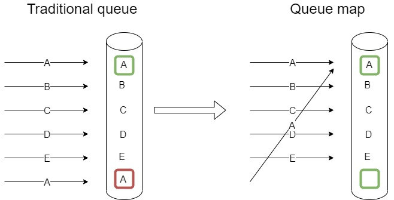
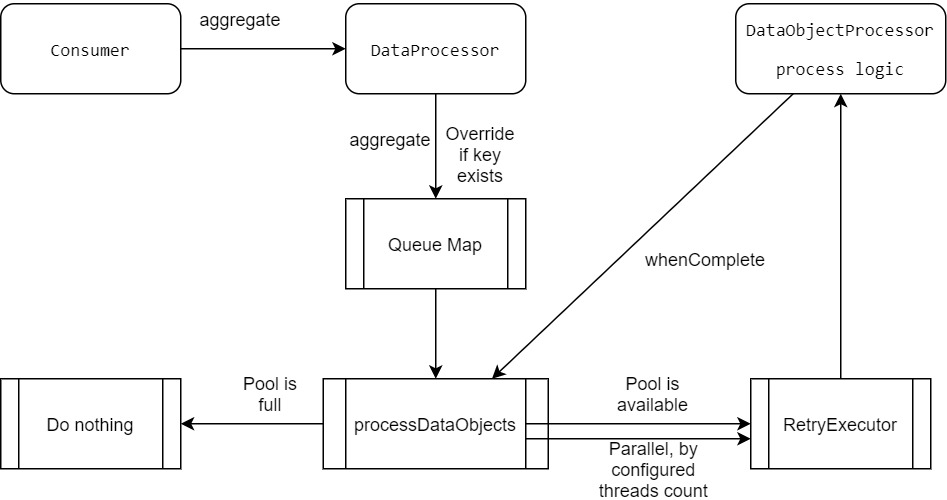

## Commons processing
Processing data objects/messages by multiple parallel consumers with ability to override pending objects tasks for saving redundant data and tasks, based on queue map.  
Using Independent asynchronous retry executor.

**Note**: This is not an official Cisco product.

## Problem & Solution


[queue.drawio](./docs/queue.drawio)

## Flow Diagram
  


[commons-processing.drawio](./docs/commons-processing.drawio)

### Highlight features 
* Ability to override pending objects tasks for saving redundant tasks. 
* Asynchronous retry mechanism for data objects processing tasks. 
* Save potential memory by holding data objects instead of tasks class instances. 
* No redundant live threads where there are no pending tasks. 

This is useful for example case where multiple notification received on same data object IDs in a time window where the previous data objects are still pending processing since the internal thread pool is running other tasks up to the core pool size limit. The data processing logic involves fetching the object from the DB and parsing the result. In this case, the new notifications will override the same data objects entries, and each data object will be fetched and processed with hopefully a single task instead of multiple times. 

DataProcessor.aggregate() vs threadPool.execute() - by the above example:

threadPool.execute: 
* 10 notifications arrive on data object with key 'x'. 
* 10 similar tasks are created and executed via the thread pool for fetching and processing the same object, 9 of them are redundant.

DataProcessor.aggregate():
* 10 notifications arrive on data object with key 'x'. 
* 10 notifications are mapped to the same single queue map entry. 
* 1 task is created and executed via the thread pool. 

The solution is in-process, non-persistent and non-distributed.  
For a persistent distributed solution, see [commons-processing-etcd](./commons-processing-etcd/README.md)

### Example usage
DataProcessor:

```
DataObjectProcessor dataObjectProcessor = new DataObjectProcessor() {
			
	@Override
	public boolean process(DataObject dataObject) {
		log.info("processing dataObject: {}", dataObject.getData());
		return true;
	}
};

DataProcessor dataProcessor = DataProcessor.builder().dataObjectProcessor(dataObjectProcessor)
		.dataObjectProcessResultHandler(resultHandler).failureHandler(failureHandler).numOfThreads(numOfThreads)
		.retries(retries).retryDelay(retryDelay).retryDelayTimeUnit(retryDelayTimeUnit).build();
				
dataProcessor.aggregate(1, dataObject);
```

RetryExecutor:

```
RetryExecutor retryExecutor = RetryExecutor.builder().build();
retryExecutor.executeAsync(supplier, pool, retryDelaySeconds, TimeUnit.SECONDS, retries, resultHandler, null);
```

See [DataProcessorTest](./commons-processing/src/test/java/com/cisco/commons/processing/DataProcessorTest.java) for further details.

## Contributions
 * [Contributing](CONTRIBUTING.md) - how to contribute.
 * [Contributors](docs/CONTRIBUTORS.md) - Folks who have contributed, thanks very much!

## Licensing

```

Licensed under the Apache License, Version 2.0 (the "License");
you may not use this file except in compliance with the License.
You may obtain a copy of the License at

    http://www.apache.org/licenses/LICENSE-2.0

Unless required by applicable law or agreed to in writing, software
distributed under the License is distributed on an "AS IS" BASIS,
WITHOUT WARRANTIES OR CONDITIONS OF ANY KIND, either express or implied.
See the License for the specific language governing permissions and
limitations under the License.
```

### Author
Liran Mendelovich

Cisco
