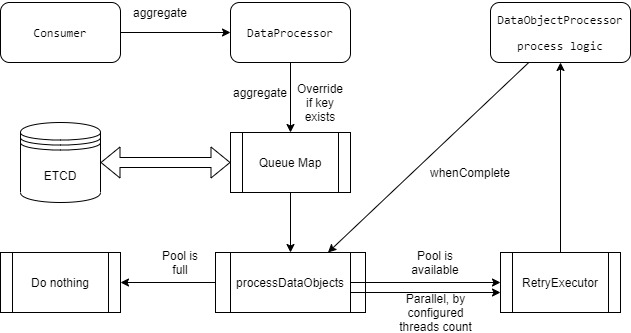

## commons-processing-etcd
Persistent distributed version of [commons-processing](../README.md), based on ETCD distributed key-value database.

**Note**: This is not an official Cisco product.

**Note #2**: commons-processing-etcd is experimental and with some open items.

## Flow Diagram
  


[commons-processing-etcd.drawio](../docs/commons-processing-etcd.drawio)

### Design
As commons-processing is built in a generic way based on insertion ordered map, it can be extended
to be persistent and distributed via several different store solutions.  
One of them is ETCD, as implemented here.  
As ETCD does not have the required LinkedHashMap data structure out of the box, it is implemented
via 2 "maps" with 2 namespaces:  

#### Timestamp namespace

##### Pending
commons-processing-etcd.queue.map.timestamp.pending.t1.random=key1  
commons-processing-etcd.queue.map.timestamp.pending.t2.random=key2  
commons-processing-etcd.queue.map.timestamp.pending.t3.random=key3  
~~commons-processing-etcd.queue.map.timestamp.pending.t4.random=key1~~ (not inserting, but overriding the already existing key value)  

##### In-progress
commons-processing-etcd.queue.map.timestamp.inprogress.t1.random=key1

#### Data namespace
commons-processing-etcd.queue.map.data.key1=value1  
commons-processing-etcd.queue.map.data.key2=value2  
commons-processing-etcd.queue.map.data.key3=value3  


### Example usage
DataProcessor:

```
DataObjectProcessor dataObjectProcessor = new DataObjectProcessor() {
			
	@Override
	public boolean process(DataObject dataObject) {
		log.info("processing dataObject: {}", dataObject.getData());
		return true;
	}
};

ETCDDataProcessor dataProcessor = ETCDDataProcessor.newBuilder().dataObjectProcessor(dataObjectProcessor)
	.dataObjectProcessResultHandler(resultHandler).failureHandler(failureHandler).numOfThreads(numOfThreads)
	.retries(retries).retryDelay(retryDelay).retryDelayTimeUnit(retryDelayTimeUnit).etcdUrl(null)
	.client(new MemoryClient())
	.build();
				
dataProcessor.aggregate(1, dataObject);
```

See [ETCDDataProcessorTest](./src/test/java/com/cisco/commons/processing/distributed/etcd/ETCDDataProcessorTest.java) for further details.

## Open items
* Testing excessively via ETCD.
* Recovery - Scenarios such as crashing while there are keys in-progress should be handled.
* Delete also the in-progress keys from timestamp namespace map.

## Assumptions
Locking is time based, not intended for long processing data object time. For large processing time, locking time can be exposed to be configured by user, and handled accordingly when lock is expired.

## Contributions
 * [Contributing](CONTRIBUTING.md) - how to contribute.
 * [Contributors](docs/CONTRIBUTORS.md) - Folks who have contributed, thanks very much!

## Licensing

```

Licensed under the Apache License, Version 2.0 (the "License");
you may not use this file except in compliance with the License.
You may obtain a copy of the License at

    http://www.apache.org/licenses/LICENSE-2.0

Unless required by applicable law or agreed to in writing, software
distributed under the License is distributed on an "AS IS" BASIS,
WITHOUT WARRANTIES OR CONDITIONS OF ANY KIND, either express or implied.
See the License for the specific language governing permissions and
limitations under the License.
```

### Author
Liran Mendelovich

Cisco
